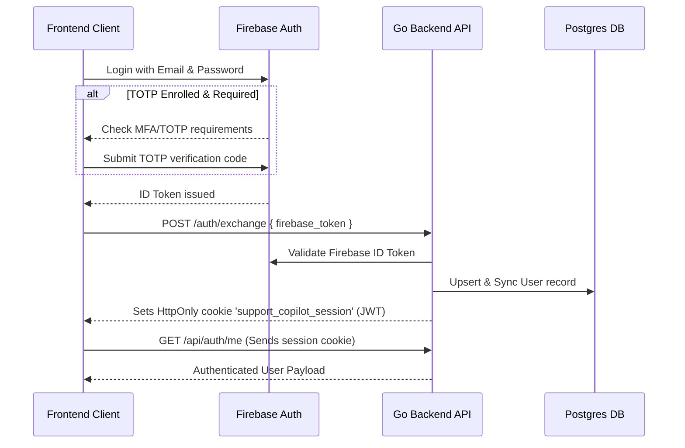

# Support Copilot

Support Copilot is a multi-component intelligent system featuring a Go backend API, a React frontend dashboard, and a FastMCP tool server. It integrates Ollama for local LLM processing and Firebase for secure Authentication (with support for TOTP Multi-Factor Authentication).

---

## 🏗️ Repository Architecture

The project is structured as follows:

*   **[backend/]**: Go-based REST API built using the [Echo v5](https://github.com/labstack/echo) framework.
    *   Uses [Cobra](https://github.com/spf13/cobra) for command-line execution (e.g., database auto-migration/seeding vs. starting the server).
    *   Uses [Viper](https://github.com/spf13/viper) for flexible configuration/environment loading.
    *   Uses [GORM](https://gorm.io/) with PostgreSQL for database persistence.
    *   Integrates with Firebase Admin SDK for verification of user credentials.
*   **[db/]**: Contains database migrations and seeding routines (e.g., seeding a default system user).
*   **[frontend/]**: A React SPA scaffolded with Vite, TypeScript, and Tailwind CSS.
    *   Uses `@assistant-ui/react` for rich, interactive AI chat components.
    *   Integrates Firebase Auth client-side, featuring TOTP MFA registration and verification.
*   **[mcp_server_1/]**: A Python-based Model Context Protocol (MCP) server built with FastMCP.

---

## 🛠️ Technology Stack

*   **Backend**: Go 1.25, Echo v5, Cobra, Viper, GORM, PostgreSQL, Firebase Admin SDK
*   **Frontend**: React 19, TypeScript, Vite, Tailwind CSS v4, `@assistant-ui/react`, Axios, Firebase SDK
*   **AI Integration**: Ollama (default: `llama3.2` model), FastMCP Python SDK

---

## ⚙️ Configuration & Environment Variables

### Root Environment (`.env`)
Create a `.env` file in the root workspace directory with the following variables:

```env
# Database Settings
DB_USER=
DB_PASSWORD=
DB_NAME=
DB_PORT=

# Firebase Integration
FIREBASE_PROJECT_ID=

# Ollama Integration
# OLLAMA_BASE_URL=http://localhost:11434
# OLLAMA_MODEL=llama3.2
```

### Frontend Environment (`frontend/.env`)
Create a `.env` file under the `frontend/` directory:

```env
VITE_API_BASE_URL=http://localhost:8080
VITE_FIREBASE_PROJECT_ID=
VITE_FIREBASE_AUTH_DOMAIN=
VITE_FIREBASE_API_KEY=
VITE_FIREBASE_APP_ID=
```

---

## 🚀 Running the Application

### Option A: Run via Containers (Compose)
The project includes a `Makefile` that uses **Podman Compose** (or standard Docker Compose) to spin up the complete environment (PostgreSQL, Go Backend, React Frontend, and FastMCP Server).

*   **Start all services:**
    ```bash
    make up
    ```
    This executes `podman compose up --build`.

*   **Stop all services:**
    ```bash
    make down
    ```

#### Exposed Services:
*   **Frontend Client**: [http://localhost:3000](http://localhost:3000)
*   **Backend API**: [http://localhost:8080](http://localhost:8080)
*   **FastMCP Service**: [http://localhost:9000/mcp](http://localhost:9000/mcp)

---

### Option B: Local Development (Step-by-Step)

If you prefer to run services individually for faster development loops:

1.  **Start the PostgreSQL Database Container:**
    ```bash
    make dev-start
    ```
2.  **Run Database Migrations and Seeding:**
    ```bash
    make migrate
    ```
    *(Runs `go run backend/main.go migrate` which seeds a system user `superadmin@company.com`)*
3.  **Start the Go Backend Server:**
    ```bash
    make dev
    ```
    *(Runs the API server on port `8080`)*
4.  **Start the FastMCP Server:**
    ```bash
    make mcp-one
    ```
    *(Runs the Python FastMCP server)*
5.  **Start the React Frontend:**
    ```bash
    cd frontend
    npm install
    npm run dev
    ```
    *(Runs the Vite dev server, typically on [http://localhost:5173](http://localhost:5173))*

---

## 🔒 Authentication Flow (Firebase + TOTP)

Support Copilot implements a secure double-token cookie-based authentication flow:



1.  **Firebase Client Auth**: The user signs in via email/password. If TOTP is set up, they complete the TOTP second-factor challenge.
2.  **Token Exchange**: The frontend sends the Firebase ID token to the backend via `POST /auth/exchange`.
3.  **MFA Checking**: The Go backend verifies the ID token with the Firebase Admin SDK.
    *   If `AUTH_TOTP_REQUIRED=true` and the user has enrolled MFA but did not complete the TOTP challenge, the backend rejects it with `403 Forbidden` (`mfa_required`).
4.  **Session Establishment**: Upon successful verification, the backend issues an HttpOnly cookie called `support_copilot_session` containing a JWT signed with `AUTH_JWT_SECRET`.
5.  **Subsequent Calls**: All endpoints under `/api/*` and `/query/*` require this cookie to authenticate queries.

---

## 📡 API Reference

### 🔐 Auth Endpoints

#### 1. Token Exchange
*   **Route**: `POST /auth/exchange`
*   **Request Payload**:
    ```json
    {
      "firebase_token": "<firebase_id_token>"
    }
    ```
*   **Response**: Sets the `support_copilot_session` HttpOnly cookie. Returns:
    ```json
    {
      "status": "authenticated"
    }
    ```

#### 2. Get Current Session Profile
*   **Route**: `GET /api/auth/me` (requires session cookie)
*   **Response**:
    ```json
    {
      "authenticated": true,
      "user_uid": "user_1",
      "user_email": "user_1@company.com"
    }
    ```

---

### 💬 Chat Query Endpoint

*   **Route**: `POST /query/chat` (requires session cookie)
*   **Request Payload**:
    ```json
    {
      "input": "How can I configure database settings?"
    }
    ```
*   **Response**:
    ```json
    {
      "output": "...Response generated by Ollama..."
    }
    ```

---

## 🤖 FastMCP Server (`mcp_server_1`)

The FastMCP python server exposes several utility tools for connected MCP clients:

| Tool Name | Parameters | Description |
| :--- | :--- | :--- |
| `chat_with_ollama` | `message: string`, `model?: string` | Queries the local Ollama instance with the user prompt. |


### Configuration
Variables from `.env` loaded by FastMCP:
*   `OLLAMA_BASE_URL`: Base address of the Ollama server (e.g., `http://localhost:11434`).
*   `OLLAMA_MODEL`: Default model (e.g., `llama3.2`).
*   `MCP_HOST` / `MCP_PORT` / `MCP_PATH`: Configures server transport host, port, and route.

---

## 🎨 Front-End Development Guidelines

When developing features in the React frontend, follow the guidelines outlined in the **[frontend/instructions.md]** file:
1.  **No `React.memo`**: Rely on automatic compiler and state-locality optimizations.
2.  **Separation of Concerns**: Decouple logic from presentation. Place state, effects, and API logic in custom hooks (e.g., `use[Component]State.ts`), keeping components purely focused on JSX rendering.
