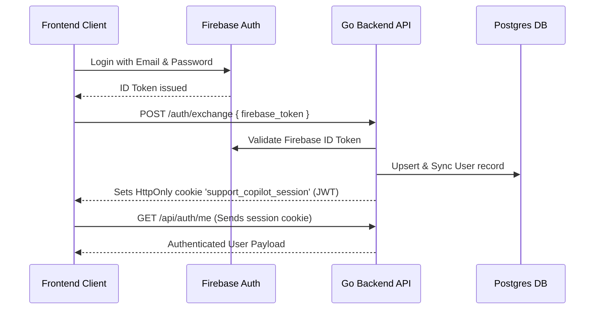
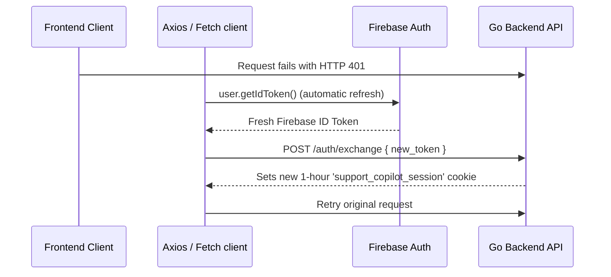
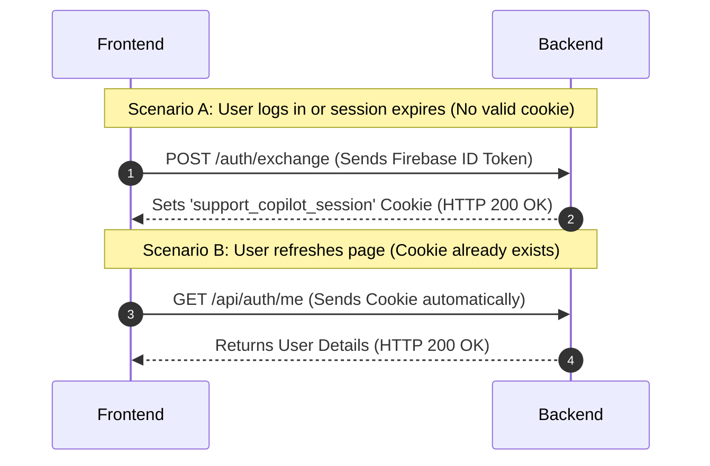

# 🔒 Authentication & Session Refresh Flow

This document explains how user sessions are managed and refreshed in the **Support Copilot** application. It covers client-side Firebase Auth, the custom Go backend session cookie, and the silent token-rotation mechanism.

---

## 🍪 1. Active User Session via Cookie

Support Copilot implements a secure, state-independent cookie session pattern to authenticate users.

### Flow Details
1. **Token Exchange**: Upon signing in with Firebase, the frontend gets a Firebase ID Token. It posts this token to the backend at `/auth/exchange`.
2. **Backend Verification**: The backend verifies the token using the Firebase Admin SDK in [ExchangeToken].
3. **Session Generation**: The backend generates its own signed HS256 JWT containing the user identity, expiring in exactly **1 hour** (see [generateAuthToken]).
4. **Cookie Attachment**: The backend returns the JWT in an `HttpOnly`, `SameSite=Lax` cookie named `support_copilot_session` (see [handler.go]).
5. **Route Middleware**: Subsequent requests to `/api/*` and `/query/*` automatically include the cookie, which is validated by the [AuthMiddleware] on the backend.

> [!NOTE]
> Setting the cookie as `HttpOnly` prevents client-side scripts from reading the token directly, mitigating cross-site scripting (XSS) token theft.

---

## 🔄 2. Token Refresh Mechanism

The application does not maintain custom backend-level database sessions or refresh tokens. Instead, it relies on the client-side **Firebase Auth SDK** to manage session duration and refresh cycles.

### Flow Details
* **Handling Session Expiration**:
  The backend session cookie is valid for 1 hour. When it expires, requests to authenticated endpoints return an HTTP `401 Unauthorized` status.
* **Axios Interceptor**:
  In [apiClient.ts], a response interceptor catches the 401 error:
  * If a Firebase user is logged in, it pauses other requests, sets `isRefreshing = true`, and queues subsequent attempts.
  * It triggers the [exchangeToken] function.
* **Firebase Silent Refresh**:
  Inside `exchangeToken`, calling `user.getIdToken()` triggers the Firebase SDK. If the Firebase session is still valid but the local ID token is expired, Firebase uses its internal refresh token (stored securely in browser storage) to get a new ID token.
* **Cookie Renewal**:
  The frontend submits the new Firebase ID token to `/auth/exchange`, renewing the `support_copilot_session` cookie for another hour.
* **Retrying Requests**:
  The interceptor replays all queued calls. For raw stream `fetch` calls, the same exchange and retry cycle is performed manually in [backendRuntime.ts].

> [!TIP]
> This pattern keeps the backend stateless while leveraging the security and convenience of Firebase's token lifecycle

---

## 🆚 3. Relationship: /auth/exchange vs /auth/me

To clarify the difference between these two endpoints:
* **`/auth/exchange`** is the **Session Creator (Write)**: It validates a Firebase ID token and issues the signed `support_copilot_session` cookie.
* **`/auth/me`** is the **Session Reader (Read)**: It reads the existing `support_copilot_session` cookie from the incoming request to verify authentication and return user identity metadata.

