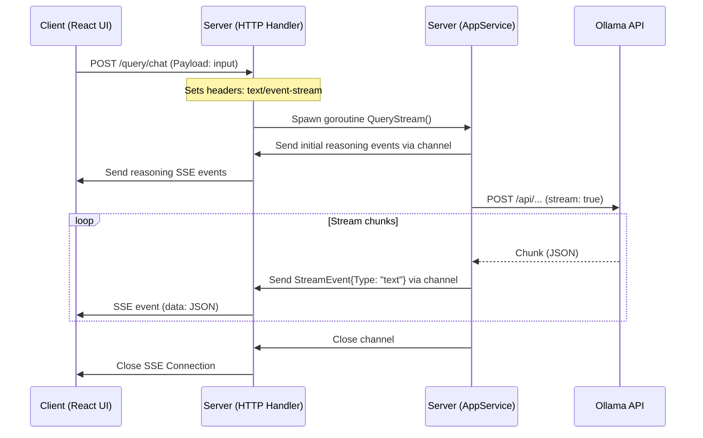

# Streaming Architecture (Ollama ↔ Server ↔ Client)

This document explains the real-time query streaming pipeline using Server-Sent Events (SSE) and Go channels.

---

## High-Level Sequence Diagram



---

## 1. Client ↔ Server Stream (SSE Setup)

In [handler.go] the endpoint [Handler.Query] accepts a query and upgrades the connection to Server-Sent Events (SSE).

### Setup and Headers
To initiate an SSE connection, the handler sets specific HTTP response headers:
- `Content-Type: text/event-stream`
- `Cache-Control: no-cache`
- `Connection: keep-alive`

```go
resp := c.Response()
resp.Header().Set("Content-Type", "text/event-stream")
resp.Header().Set("Cache-Control", "no-cache")
resp.Header().Set("Connection", "keep-alive")
resp.WriteHeader(http.StatusOK)

flusher, ok := resp.(http.Flusher)
flusher.Flush()
```
The response writer is asserted to `http.Flusher` to allow immediate transmission of data chunks downstream.

### Channel Concurrency
Two channels are initialized:
- `streamChan` (typed as [StreamEvent]): passes events from the backend service to the handler.
- `errorChan`: handles any errors occurring in the background worker.

A background goroutine is spawned to call [AppService.QueryStream]:
```go
go func() {
    err := h.apps.QueryStream(c.Request().Context(), req.Input, streamChan)
    if err != nil {
        errorChan <- err
    }
    close(streamChan)
}()
```

---

## 2. Server ↔ Ollama Communication

In [service.go], the service layer establishes a chunk-by-chunk HTTP stream from the Ollama backend API.

### Initial UI Reasoning States
Before sending requests to Ollama, the service updates the client UI with status updates:
```go
streamChan <- StreamEvent{
    Type:    "reasoning",
    Content: "Analyzing prompt...\n ",
}
```

### Ollama Payload
The service creates an HTTP POST request targeting the Ollama API with `"stream": true` enabled:
```go
payload := map[string]interface{}{
    "model":  config.Get().Ollama.Model,
    "stream": true,
    "messages": []map[string]string{
        {
            "role":    "user",
            "content": prompt,
        },
    },
}
```

---

## 3. Streaming and Decoding Chunk Loop (Ollama ↔ Server)

The response body from Ollama contains newline-delimited JSON chunks. The service decodes these chunks in a loop:

```go
decoder := json.NewDecoder(resp.Body)
for {
    var chunk struct {
        Message struct {
            Content string `json:"content"`
        } `json:"message"`
        Done bool `json:"done"`
    }

    if err := decoder.Decode(&chunk); err == io.EOF {
        break // Stream finished naturally
    } else if err != nil {
        return fmt.Errorf("error decoding ollama chunk: %w", err)
    }

    if chunk.Message.Content != "" {
        streamChan <- StreamEvent{
            Type:    "text",
            Content: chunk.Message.Content,
        }
    }

    if chunk.Done {
        break // Stop looping when Ollama signals it is done
    }
}
```

For each valid content chunk, a [StreamEvent] of type `"text"` is pushed onto `streamChan`.

---

## 4. Multiplexed Event Loop (Server ↔ Client)

The handler uses a multiplexed `select` block inside a `for` loop to route messages from channels to the HTTP response stream:

```go
for {
    select {
    case event, ok := <-streamChan:
        if !ok {
            return nil // stream finished successfully
        }
        eventJSON, _ := json.Marshal(event)
        fmt.Fprintf(resp, "data: %s\n\n", eventJSON)
        flusher.Flush()

    case err := <-errorChan:
        slog.Error("query stream failed", "err", err)
        errMsg := fmt.Sprintf(`{"type": "text", "content": "\n\n**Error:** %s"}`, err.Error())
        fmt.Fprintf(resp, "data: %s\n\n", errMsg)
        flusher.Flush()
        return nil

    case <-c.Request().Context().Done():
        log.Println("Client Disconnected, aborting stream")
        return nil
    }
}
```

### Key Elements of the Event Loop:
1. **SSE Protocol format**: Data is formatted as `data: <JSON>\n\n`.
2. **Immediate Flush**: `flusher.Flush()` makes sure that the buffer is written immediately to the client socket.
3. **Resiliency**: If a user cancels or closes their browser tab, `c.Request().Context().Done()` halts execution instantly.
